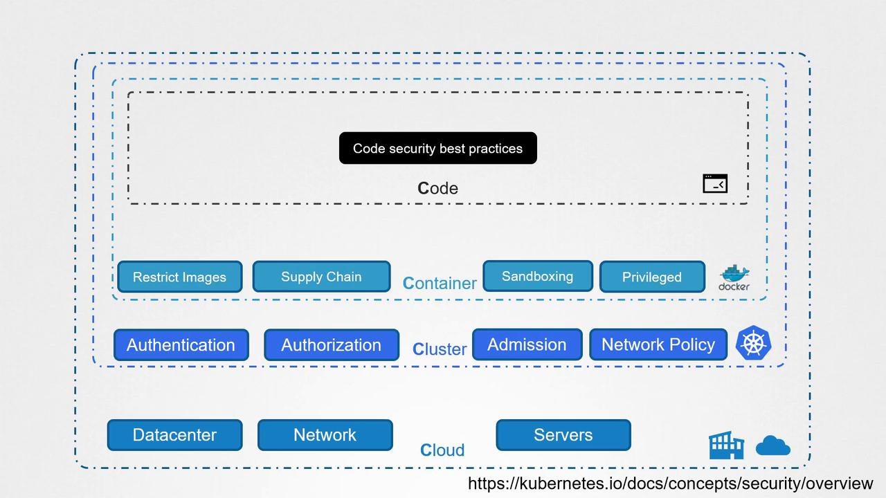

# The 4Cs of Cloud Native Security

1. ☁️ Cloud
2. 🧱 Cluster
3. 📦 Container
4. 💻 Code

---

# Overview of Vulnerabilities and Mitigations
| C              | Focus Area         | Common Attack Vectors                                    | Key Best Practices |
|----------------|--------------------|----------------------------------------------------------|--------------------|
| ☁️ Cloud      | Infrastructure        | Exposed management ports, overly permissive IAM roles | Firewalls, VPN/bastion, role audits | 
| 🧱 Cluster    | Control Plane & APIs  | Public Docker API, unsecured Kubernetes API/Dashboard | Secure APIs, RBAC, OIDC/TLS, regular patching | 
| 📦 Container  | Workload Isolation    | Untrusted images, privileged containers, lax runtime  | Image signing/scanning, PSP/PSA, seccomp, resource limits | 
| 💻 Code       | Application & Secrets | Hard-coded credentials, plaintext env vars, no mTLS   | Vault/K8s Secrets (encrypted), mutual TLS, code reviews | 

---

## ☁️ Cloud Security
- The first "C" is **Cloud** Security, which focuses on protecting the overall infrastructure (cloud, on-prem, hybrid).
- 🔒 **Key Considerations**:
  - Implement **robust firewalls** and **network segmentation**.
  - Enforce **IAM policies** and **least privilege** access.
  - Regularly audit open ports and unused services.

## 🧱 Cluster Security
- The second "C" focuses on securing the Kubernetes **Cluster** itself.
- The attacker can compromised the system by exploiting a publicly accessible Docker daemon and an unsecured Kubernetes dashboard that lacked proper authentication and authorization measures.
- 🔐 **To secure the cluster**:
  - Protect the Docker daemon with socket permissions and firewall rules.
  - Harden the Kubernetes API with role-based access control (RBAC).
  - Restrict access to the Kubernetes Dashboard and enforce authentication.
  - Apply network policies to segment pod communication.
  - Use PodSecurityPolicies or OPA/Gatekeeper for workload controls.

## 📦 Container Security
- The third "C" addresses **Container** Security.
- 🧱 **Risks**:
  - Deploying unverified or vulnerable images.
  - Running containers with excessive privileges.
- 🛡️ **To mitigate these risks**:
  - Enforce image source control—allow only signed images from trusted registries.
  - Disallow privileged mode and avoid running as root.
  - Use tools like AppArmor, Seccomp, and gVisor for sandboxing.
  - Implement continuous image scanning (e.g., Trivy, Clair).

## 💻 Code Security 
- The final "C" focuses on **Code** Security.
- Although not the main focus for this course, securing application code remains critical. 
- 🔑 **Common pitfalls**:
  - Hardcoding secrets (API keys, DB credentials).
  - Passing sensitive data via environment variables.
  - No TLS encryption for communication.
- 🛠️ **Best Practices**:
  - Use Secrets Management solutions like Vault, AWS Secrets Manager, or Sealed Secrets.
  - Enable mTLS between microservices.
  - Integrate static code analysis and SCA tools in CI/CD pipelines.

---

