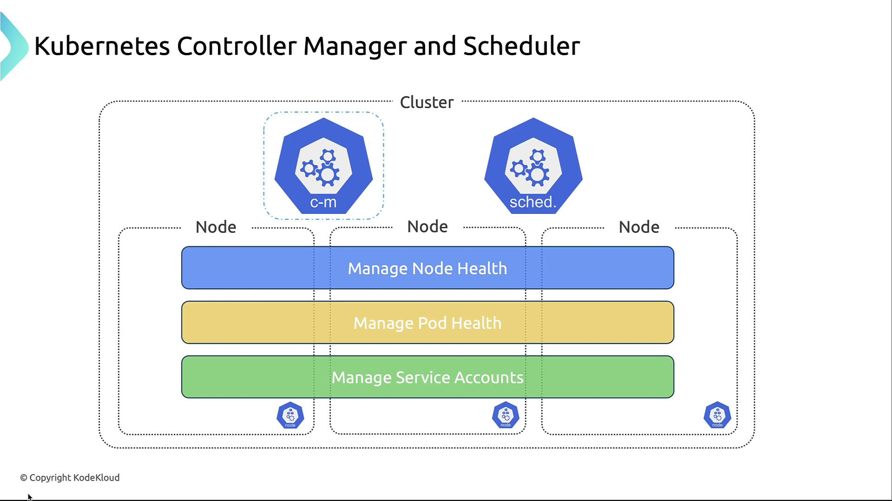

# Securing Controller Manager and Scheduler

In this guide, we detail security best practices for hardening the Kubernetes Controller Manager and Scheduler.

# 🛡️ Controller Manager and Scheduler Roles
- **Controller Manager**: 
    - Monitors node and pod health
    - Maintains the desired number of pod replicas
    - Manages service accounts via controllers (e.g., ReplicationController, EndpointController, NamespaceController, ServiceAccountController)
- **Scheduler**: 
    - Assigns Pods to Nodes based on resources and policies. 



## 1. Isolation on Dedicated Nodes
- Running the Controller Manager and Scheduler on isolated master nodes prevents compromised application pods from reaching critical control-plane components.
    - Dedicate nodes exclusively for control-plane services
    - Taint master nodes to avoid scheduling regular workloads
    - Monitor and patch these nodes independently

## 2. RBAC with Least Privilege

| Component           | Allowed Actions                          | Denied Actions                   |
|---------------------|------------------------------------------|----------------------------------|
| Controller Manager  | Manage ReplicaSets, Endpoints, Services  | Secrets, NetworkPolicies         |
| Scheduler           | List/watch Pods, Nodes, Bindings         | Creating Roles, etcd access      | 


## 3. Encrypting Communications with TLS
- Encrypt communication between API Server, Scheduler, Controller Manager, etcd.
- Use mTLS with a trusted CA, automate certificate renewal.
- Monitor cert expirations to avoid outages.

## 4. Audit Logging
- Enable detailed logs for API interactions.
- Capture who changed what, via which component (e.g., ReplicaSet updates).
- Integrate with Prometheus/Grafana for alerting.

```ini
Event Type: PATCH
Timestamp: 2024-11-09T12:34:56Z
Description: ReplicaSet controller updated deployment "my-deployment" in namespace "default" to adjust replicas to 3. Request by user "system:serviceaccount:kube-system:replicaset-controller" from IP 10.10.10.10. Status: 200 OK.


Event Type: GET
Timestamp: 2024-11-09T12:35:12Z
Description: Kube Controller Manager retrieved config map "kube-root-ca.crt" in namespace "kube-system". Request by user "system:serviceaccount:kube-system:kube-controller-manager" from IP 10.10.10.11. Status: 200 OK.


Event Type: PATCH
Timestamp: 2024-11-09T12:35:45Z
Description: Horizontal Pod Autoscaler adjusted settings for "my-app-autoscaler" in namespace "default" to min replicas 2, max replicas 10, target CPU utilization 80%. Request by user "system:serviceaccount:kube-system:horizontal-pod-autoscaler" from IP 10.10.10.12. Status: 200 OK.
```

---

# ✅ Summary
1. Isolate Controller Manager and Scheduler on dedicated, tainted nodes
2. Enforce RBAC with least privilege.  
3. Encrypt all control-plane communication (TLS/mTLS).  
4. Enable and monitor audit logs.  
5. Secure kubeconfig, default configs; rotate certs.  
6. Keep components up to date and scan for vulnerabilities.
