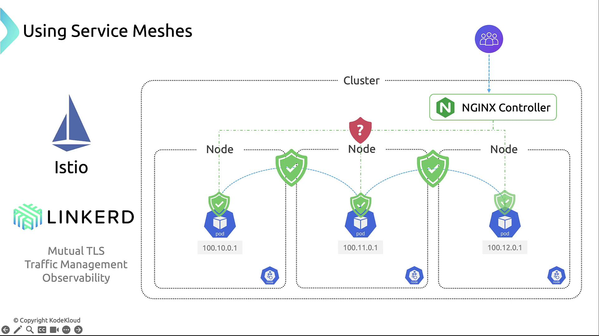

# Securing Container Networking

- Networking in Kubernetes allows communication between pods, services, and external clients. 
- However, by default, all pods can communicate with each other, which poses a security risk.

## 🎯 Objectives of Securing Networking
- Prevent unauthorized access between workloads.
- Isolate sensitive applications.
- Enforce least privilege access.

## 🔐 Network Security Strategies

### 1. Use Network Policies
- Network Policies allows to control **ingress** (incoming) and **egress** (outgoing) traffic at the **pod level**.
- By default, all Pod-to-Pod traffic is permitted. To establish a secure baseline, use a deny-by-default policy:
    ```yml
    apiVersion: networking.k8s.io/v1
    kind: NetworkPolicy
    metadata:
    name: deny-all
    namespace: default
    spec:
    podSelector: {}
    policyTypes:
        - Ingress
        - Egress
    ingress: []
    egress: []
    ```

### 2. Service-to-Service Security with a Service Mesh
- Deploying a service mesh such as **Istio** or **Linkerd** adds powerful features:



- Mutual TLS (mTLS) encrypts and authenticates service-to-service calls.
- Fine-grained traffic management: retries, timeouts, and routing rules.
- Built-in telemetry, metrics, and logs for full observability.

### 3. Encrypting Network Traffic Between Nodes
- Protect data in transit at the network layer by enabling encryption with CNI plugins like **Calico**:
    - Calico + IPsec: Encrypts all inter-node traffic without requiring additional hardware.
    - WireGuard: A lightweight, high-performance VPN alternative. 

### 4. Isolating Sensitive Workloads
- Segregate critical applications into dedicated namespaces and apply strict policies to reduce lateral movement.
- By combining namespaces with network policies, we can limit which teams or services can communicate, containing any potential breach.

---

# Summary
- Define **Network Policies** to control Pod-level traffic.
- Deploy a **Service Mesh** for mTLS and advanced routing.
- Encrypt inter-node traffic with **IPsec** or **WireGuard**.
- Use **Namespaces and strict policies** to isolate workloads.
