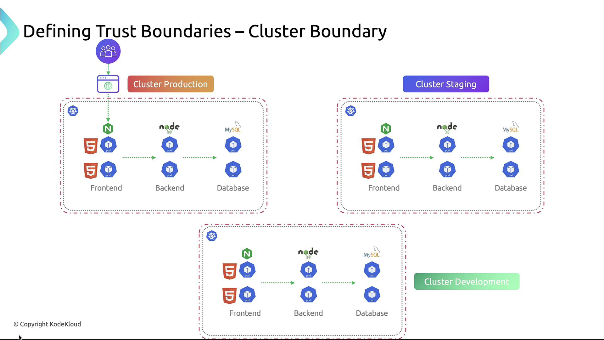
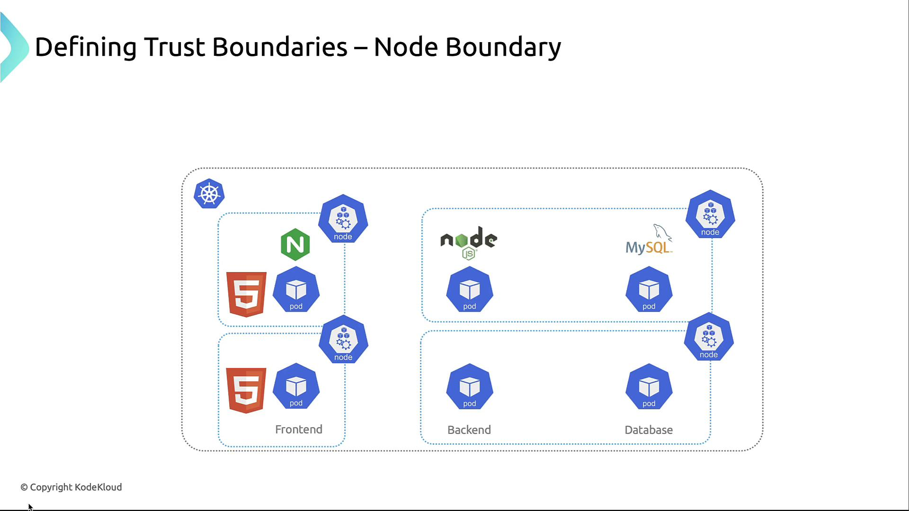
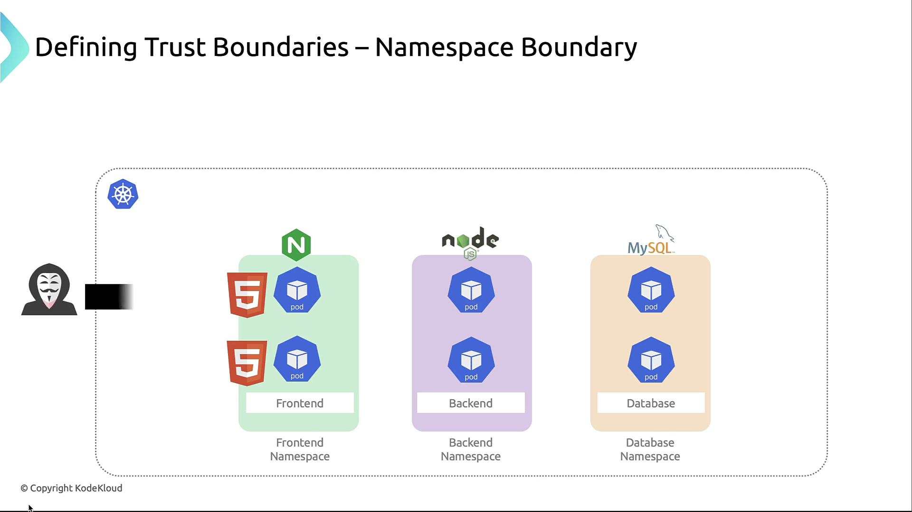
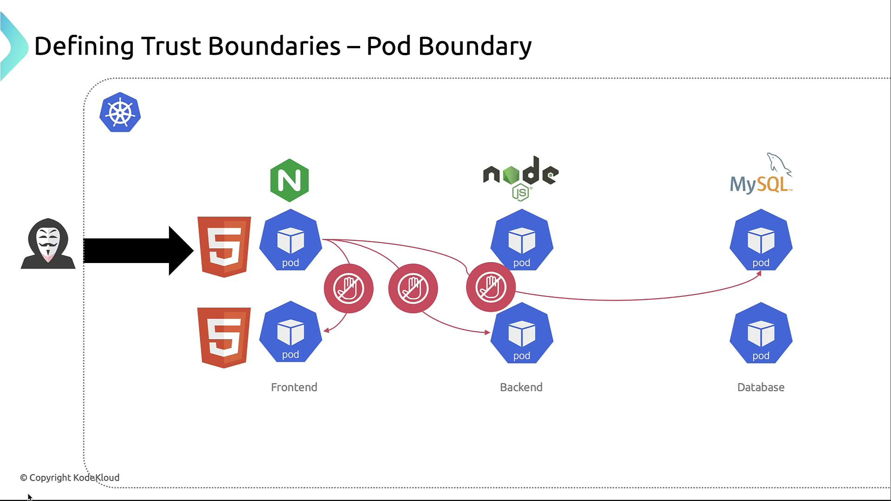
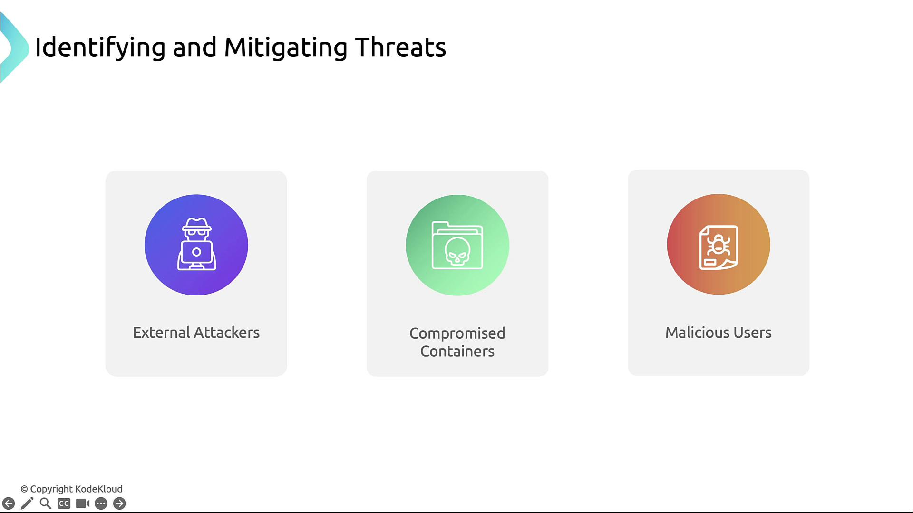

# Kubernetes Trust Boundaries and Data Flow

Understanding trust boundaries and data flow is essential to identifying and mitigating risks in a Kubernetes cluster.

## 📍 What are Trust Boundaries?
- A **trust boundary** defines where **different levels of trust** exist in a system. 
- When data crosses a trust boundary, **security controls** (like authentication or encryption) should be in place.

## Threat Modeling Process
- Threat modeling identifies, prioritizes, and mitigates security risks early:
    1. Identify potential threats—enumerate attack scenarios.
    2. Assess impact—evaluate risk severity and likelihood.
    3. Implement countermeasures—design controls to reduce risk.

---

## Defining Trust Boundaries

### 1. Cluster Boundary
- Using separate clusters for dev, staging, and prod isolates environments at the highest level.

    

### 2. Node Boundary
- Each node is a compute-level boundary. 
- Harden kubelet, restrict SSH, and apply host-based firewalls so a compromised node doesn’t expose others.

    

### 3. Namespace Boundary
- Namespaces group related workloads and serve as the primary authorization unit. 
- Use RBAC and NetworkPolicies to enforce least privilege.

    

### 4. Pod Boundary
- Each pod defines a network and security context. 
- Use **NetworkPolicies** to prevent unrestricted pod-to-pod traffic.

    

### 5. Container Boundary
- Within pods, container runtimes enforce isolation. 
-  patterns and runtime policies (AppArmor, seccomp) reduce risk of breakout between containers.

---

## Trust Boundary Summary

| Trust Boundary | Scope                     | Example Controls                                      |
|----------------|---------------------------|-----------------------------------------------------|
| Cluster        | Entire Kubernetes cluster | VPC segregation, dedicated clusters |
| Node           | Single compute host       | Node hardening, kubelet auth, host OS patches   |
| Namespace      | Logical partition         | RBAC roles, NetworkPolicies       |
| Pod            | Application instance      | PodSecurityPolicies, egress/ingress policies |
| Container      | Container process         | AppArmor, seccomp, minimal base images  |

---

## Common Threat Actors
- **External Attackers**: Scanning for exposed endpoints.
- **Compromised Containers**: Exploited via vulnerabilities or misconfigurations.
- **Malicious Users**: Insiders abusing privileges.

    
