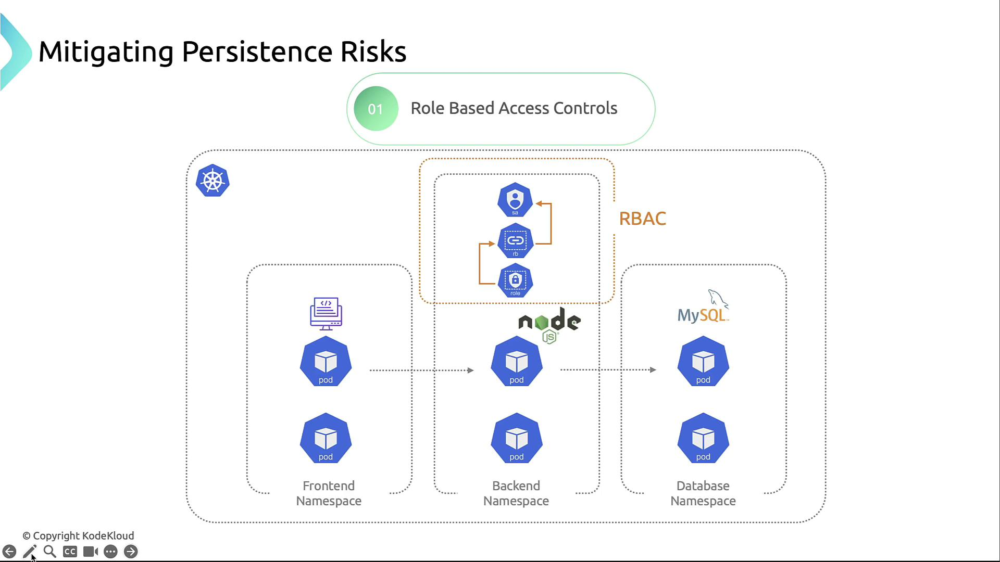
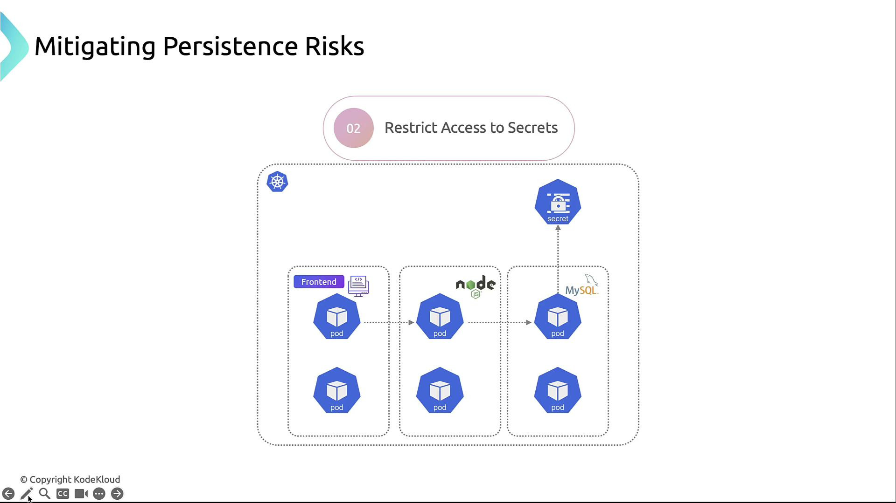
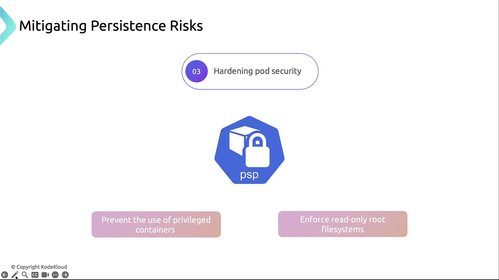
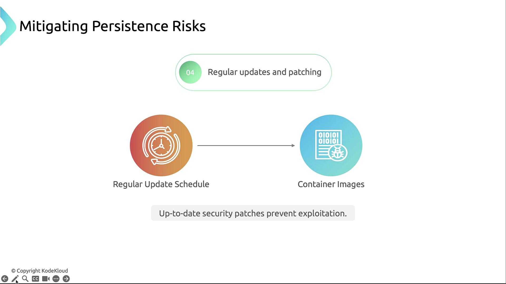
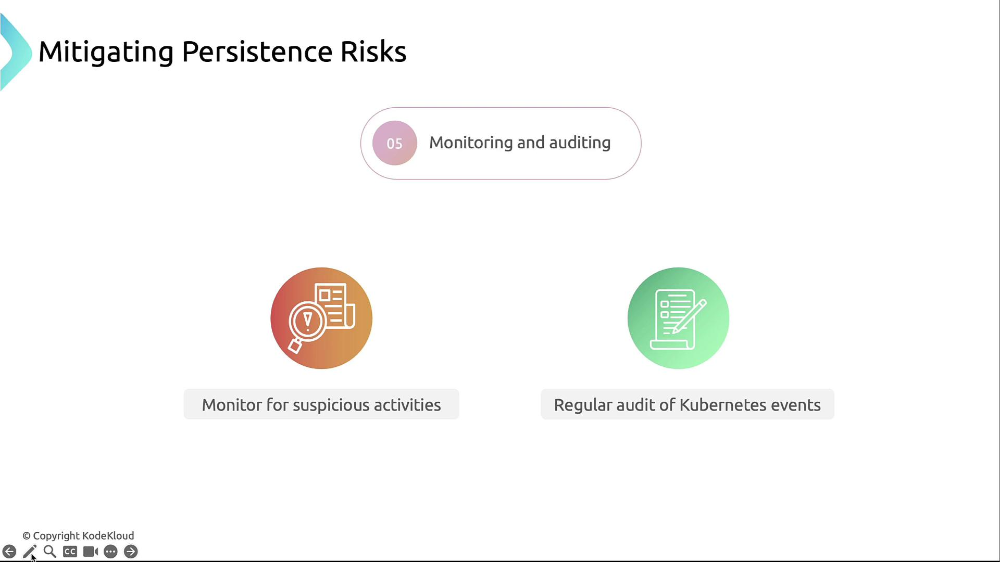

# Kubernetes Threat Model: Persistence

Persistence refers to an attacker’s ability to **maintain access** to a compromised Kubernetes environment **even after reboots, re-deployments, or detection attempts**.

## 🔄 What is Persistence in Kubernetes?
In the Kubernetes context, **persistence** means:
- Surviving pod restarts or deletions.
- Maintaining access **even after a node or pod is destroyed**.
- Creating or modifying Kubernetes resources that are not ephemeral.

## 🎯 Common Persistence Techniques

| Technique                       | Description |
|----------------------------------|-------------|
| **Malicious DaemonSets**         | Deploying a DaemonSet that ensures a malicious pod runs on **every node**. |
| **Backdoored Images**            | Using a container image that includes tools or scripts to allow future access. |
| **Malicious Admission Controllers** | Injecting code during pod creation via compromised admission webhooks. |
| **Storing Secrets in etcd**      | Adding or modifying secrets in etcd to inject malicious data into workloads. |
| **Manipulating CronJobs**        | Creating scheduled tasks that regularly run malicious code. |
| **Abusing ServiceAccounts**      | Binding excessive privileges to long-lived ServiceAccounts. |
| **Custom Controllers / Operators** | Creating custom Kubernetes components that silently maintain access. |

## 🧹 Mitigations for Persistent Threats

| Action                          | Description                                                  |
| ------------------------------- | ------------------------------------------------------------ |
| **Restrict RBAC**               | Use least privilege for users, pods, and ServiceAccounts.    |
| **Monitoring and Logging**      | Detect abnormal actions or deployments.                      |
| **Image scanning**              | Use tools like Trivy, Clair to detect backdoors.             |
| **Admission controllers or Pod Security Standards**       | Prevent suspicious or unverified workloads from running.     |
| **Read-only root file systems** | Prevent attackers from persisting changes inside containers. |
| **Secrets Management**          | Store credentials in Kubernetes Secrets.                     |

### 1. Role-Based Access Control (RBAC)
- Grant the least privilege to service accounts.
- Regularly audit `ClusterRole` and `Role` bindings.

    

### 2. Secrets Management
- Store credentials in Kubernetes Secrets.
- Restrict secrets to only the pods that require them.

    

### 3. Pod Security Standards
- Enforce Pod Security Admission (PSA) or Pod Security Policies (PSP).
- Disallow `privileged` containers and `hostPath` mounts.
- Set `readOnlyRootFilesystem: true` where possible.

    

### 4. Regular Updates & Patching
- Use image scanning tools to detect vulnerabilities.
- Automate rolling updates for base images:
    ```bash
    kubectl set image deployment/nginx nginx=nginx:1.21.6
    ```

    

### 5. Monitoring & Auditing
- Centralize logs (e.g., using Elasticsearch, Fluentd, Kibana).
- Alert on unexpected pod restarts, new privileged pods, or RBAC changes.
- Periodically review the audit log via `kubectl logs -n kube-system`.

    

---

## ✅ Summary
- Enforce strict RBAC and Pod Security Standards
- Secure and rotate Secrets regularly
- Keep images and nodes up to date
- Monitor, audit, and alert on suspicious actions
