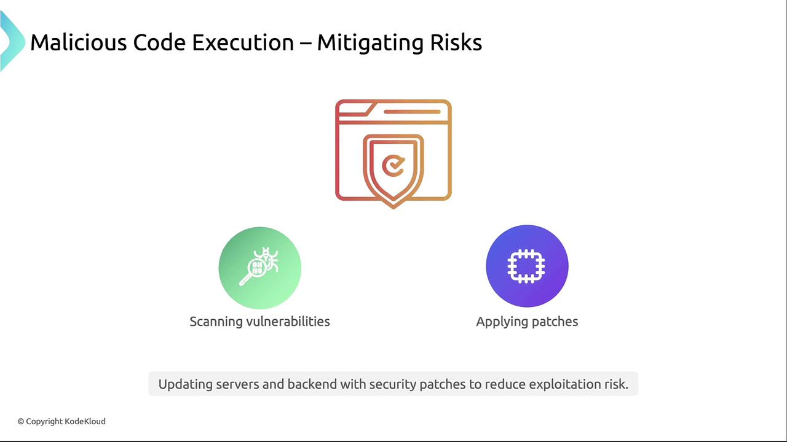
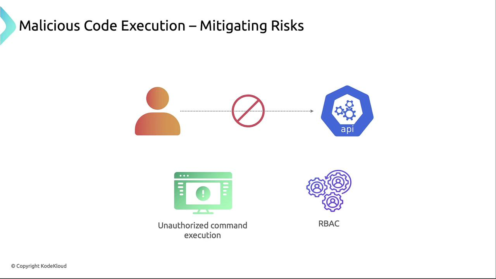
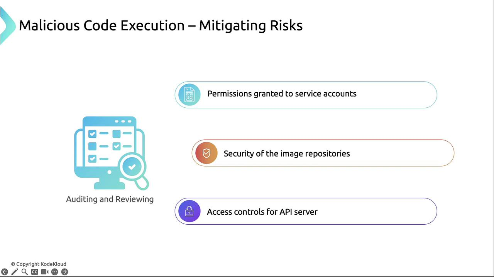

# Kubernetes Threat Model: Malicious Code Execution

Malicious code execution in a Kubernetes cluster refers to **unauthorized or harmful code running inside containers or on nodes**, which can compromise workloads, steal data, or escalate privileges.

🎯 Objective
- Gain **unauthorized execution** capabilities within containers or nodes.
- Exploit misconfigurations or vulnerabilities.
- Execute commands that lead to **further attacks**, such as privilege escalation or data exfiltration.

## 🧱 Common Attack Vectors

| Attack Vector | Description |
|---------------|-------------|
| **Compromised Images** | Malicious code embedded in container images. |
| **Container Breakout** | Exploiting container runtime or host kernel to escape and access the host. |
| **Privileged Containers** | Containers with escalated privileges can access host resources. |
| **Mounting Sensitive Volumes** | Attacker mounts hostPath or service account secrets. |
| **Unsafe Capabilities** | Using Linux capabilities like `SYS_ADMIN`, `NET_ADMIN`, etc. |
| **Insecure Shell Access** | Gaining shell access to running containers using exposed interfaces. |

## 🔐 Mitigation Strategies

| Defense Mechanism                      | Description                                                          |
| -------------------------------------- | -------------------------------------------------------------------- |
| **Use Trusted Images**                 | Pull from verified registries; enable image scanning.                |
| **Disable Privileged Mode**            | Avoid setting `privileged: true` unless absolutely necessary.        |
| **Restrict Linux Capabilities**        | Drop all unnecessary capabilities using `securityContext`.           |
| **Read-Only Filesystem**               | Prevent code modifications in containers.                            |
| **Limit hostPath Mounts**              | Avoid giving containers direct access to host filesystem.            |
| **Use PodSecurity Policies/Standards** | Enforce best practices via Pod Security Admission or OPA/Gatekeeper. |
| **Use SELinux/AppArmor**               | Apply mandatory access control on containers.                        |
| **Audit Logs**                         | Monitor container activity and shell usage.                          |

### 1. Scan and Patch Vulnerabilities
- Regularly scan container images and host OS for CVEs. 
- Integrate vulnerability scanners like Trivy in your CI/CD pipeline and apply security patches promptly.

    

### 2. Restrict API Server Access
- Enforce strong authentication and granular RBAC policies so that only trusted identities can call sensitive API endpoints.

    

### 3. Secure Image Repositories and Pull Secrets
- Store the image pull secrets in encrypted vaults (e.g., HashiCorp Vault). 
- Limit service accounts that can reference them and enforce image signing to verify integrity.

    ```bash
    kubectl create secret docker-registry my-image-pull-secret \
    --docker-username=<username> \
    --docker-password=<password> \
    --docker-server=<registry-url> \
    --namespace=default
    ```

    ```yml
    apiVersion: v1
    kind: Pod
    metadata:
        name: my-secure-pod
        namespace: default
    spec:
    serviceAccountName: specific-service-account
    containers:
        - name: myapp
        image: <registry-url>/myapp:latest
    imagePullSecrets:
        - name: my-image-pull-secret
    ```

### 4. Monitor and Alert
- Use audit logs and monitoring tools to detect exec calls, secret changes, or anomalous API usage. 
- For Kubernetes clusters with Prometheus:
    ```yml
    apiVersion: monitoring.coreos.com/v1
    kind: PrometheusRule
    metadata:
        name: security-monitoring-rules
        namespace: default
    spec:
    groups:
        - name: security-alerts
        rules:
            - alert: SecretChangeDetected
            expr: kube_secret_info
            for: 1m
            labels:
                severity: critical
            annotations:
                summary: "Secret Change Detected"
                description: "A change was detected in a Kubernetes Secret, which could indicate unauthorized access or tampering."
            - alert: CommandExecutionInContainer
            expr: increase(kube_audit_event_total{verb="exec"}[5m]) > 0
            for: 1m
            labels:
                severity: warning
            annotations:
                summary: "Exec API call detected in container"
                description: "An exec call was detected in container {{ $labels.container }} via the API. This might indicate suspicious activity."
    ```

### 5. Audit and Review
- Periodically review RBAC roles, service account permissions, and image registry policies. 
- Conduct penetration tests to validate your security posture.

    

---

## 📌 Summary
- Restrict API server access to authorized roles.
- Secure image registries and enforce signed images.
- Monitor audit logs and set up real-time alerts.
- Keep containers and hosts up to date with patches.
- Regularly audit RBAC, service accounts, and CI/CD pipelines.
