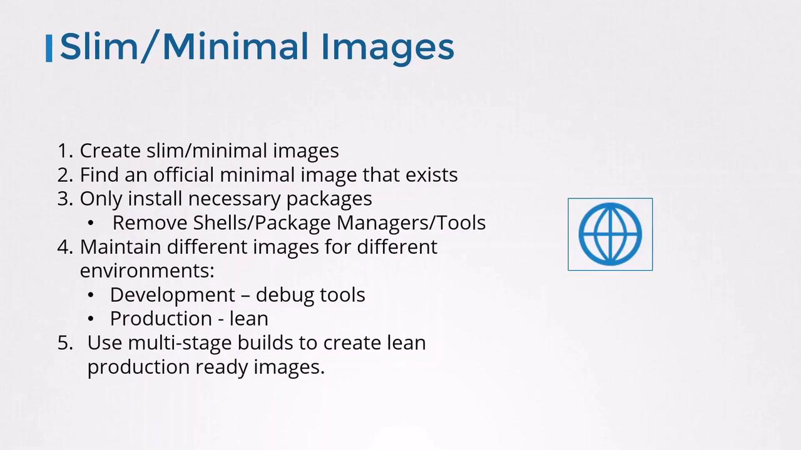

# Supply Chain Security: Minimize Base Image Footprint

- Reducing the base image footprint of containers is a critical supply chain security measure. 
- Smaller, purpose-built images reduce the **attack surface**, **vulnerabilities**, and **dependency management overhead**.

## Understanding Parent vs Base Images
- Every Docker build begins with a `FROM` instruction. 
- The image you specify is the **parent image**, and its ancestors are known as **base images**.
    ```docker
    # 1. Your application image
    FROM httpd
    COPY index.html /usr/local/apache2/htdocs/index.html
    ```
- Here, `httpd` is the parent. But what is `httpd` built from?
    ```docker
    # 2. The httpd image
    FROM debian:buster-slim
    ENV HTTPD_PREFIX=/usr/local/apache2
    ENV PATH=$HTTPD_PREFIX/bin:$PATH
    WORKDIR $HTTPD_PREFIX
    # ...install Apache HTTP Server...
    ```
- And finally:
    ```docker
    # 3. The Debian image
    FROM scratch
    ADD rootfs.tar.xz /
    CMD ["bash"]
    ```
- When an image starts `FROM scratch`, it sits at the bottom of the chain—there are no layers beneath it.

> [!NOTE]
> Images built FROM scratch are true minimal bases. Everything in your container must be added explicitly.

---

## 🎯 Why Minimize the Base Image?

| Benefit | Description |
|--------|-------------|
| **Smaller Attack Surface** | Fewer tools and packages mean fewer potential vulnerabilities. |
| **Lower CVE Count** | Minimal images include fewer outdated or insecure packages. |
| **Faster Build & Deployment** | Smaller image sizes improve CI/CD performance. |
| **Reduced Dependencies** | Eliminate unnecessary binaries, reducing maintenance and patching. |

---

## 📦 Best Practices for Building Minimal Images

### 1. Design for Modularity
- Build one service per image. 
- Compose them together at runtime for scalability and separation of concerns.

### 2. Keep Containers Stateless
- Containers should be ephemeral. 
- Persist data in external volumes or managed services like Redis.

### 3. Choose an Appropriate Base
- Official, regularly-updated images (e.g., `nginx`, `httpd`) reduce risk. 
- Verify publishers and check update frequency.

### 4. Keep Images Small
- Start from minimal OS distributions (Alpine, Debian Slim).
- Only install required libraries.
- Clean up caches and package metadata.
- Remove build tools (`curl`, `wget`, package managers) after install.
- Use multi-stage builds for production artifacts.

    

---

## 📦 Recommended Base Images

| Base Image | Description |
|------------|-------------|
| **Distroless** | No package manager, no shell; includes only app & runtime. |
| **Alpine Linux** | Small (~5MB), includes busybox tools; requires static binaries. |
| **Scratch** | Completely empty base; ideal for static Go binaries or fully self-contained apps. |

---

## ⚠️ Considerations When Using Minimal Images

| Concern | Solution |
|--------|----------|
| **Lack of Debug Tools** | Use ephemeral debug containers or switch to debug image during troubleshooting. |
| **Compatibility Issues** | Ensure your app runs without tools/libraries stripped from the image. |
| **Build-time vs Run-time Images** | Separate full-featured build image from minimal runtime image (multi-stage builds). |

---

## Security Benefits of Minimal Images
- Smaller images have fewer components to scan—and fewer vulnerabilities. 
- For instance, scanning the Debian-based `httpd` image with Trivy reports:
    ```bash
    trivy image httpd
    httpd (debian 10.8)
    ====================
    Total: 124 (UNKNOWN: 0, LOW: 88, MEDIUM: 9, HIGH: 25, CRITICAL: 2)
    ```
- Switching to an Alpine-based httpd drops known issues to zero:

    | Image                   | OS            | Total Vulnerabilities | High / Critical |
    |-------------------------|---------------|-----------------------|-----------------|
    | `httpd:2.4-buster-slim` | Debian Buster | 124                   |27               |
    | `httpd:2.4-alpine`      | Alpine Linux  | 0                     | 0               |
