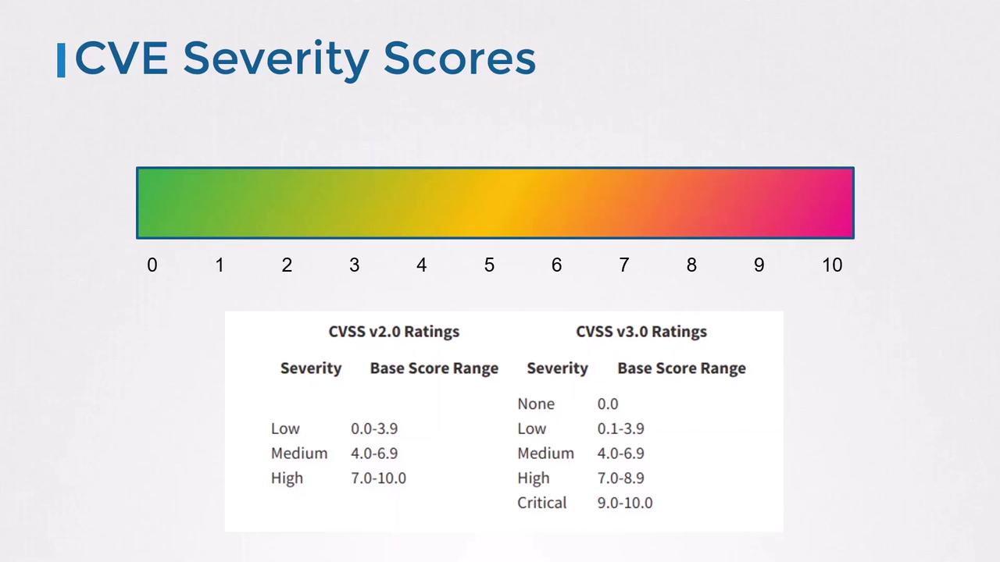

# Supply Chain Security: Scan Images for Known Vulnerabilities

Image scanning is a vital security measure that identifies known vulnerabilities (CVEs) in container images before they are deployed into a cluster.

## What Is a CVE?
- **Common Vulnerabilities and Exposures (CVE)** is the industry-standard database for public security flaws. 
- Each vulnerability gets a unique identifier, helping you avoid duplicates and streamline research.
- Typical CVE categories include:
    - Unauthorized access bypasses (e.g., confidential data exposure)
    - Denial-of-service or performance degradation bugs

### Understanding CVSS Severity Ratings
- The Common Vulnerability Scoring System (CVSS) provides both a numeric score (0–10) and a qualitative severity label. 
- Use the table below to interpret scores:

    | Severity  | CVSS Score Range |
    |-----------|------------------|
    | None      | 0.0              |
    | Low       | 0.1 – 3.9        |
    | Medium    | 4.0 – 6.9        |
    | High      | 7.0 – 8.9        |
    | Critical  | 9.0 – 10.0       |

    

---

## 🎯Why Scan Container Images?

| Reason | Explanation |
|--------|-------------|
| **Identify Vulnerabilities Early** | Catch issues before they reach production. |
| **Maintain Compliance** | Ensure adherence to security standards and audits. |
| **Reduce Attack Surface** | Remove or fix vulnerable packages before deployment. |

---

## 🔧 Common Image Scanning Tools

| Tool | Highlights |
|------|-----------|
| **Trivy** | Lightweight, open-source, scans OS packages and app dependencies. |
| **Grype** | Fast and easy to integrate, supports multiple ecosystems. |
| **Docker Scout** | Built into Docker Hub, helps track and remediate CVEs. |
| **Clair** | Static analysis tool by CoreOS, integrates with registries. |
| **Anchore Engine** | Powerful open-source scanner with policy enforcement. |

---

## 📦 What Do These Scanners Check?
- OS-level vulnerabilities (e.g., `apt`, `yum` packages)
- Application dependencies (e.g., `npm`, `pip`, `gem`)
- Known CVEs based on image digest
- Misconfigurations in Dockerfiles (in some tools)

---

## 🧪 Integration with CI/CD

| Stage | Benefit |
|-------|---------|
| **Build Stage** | Prevents vulnerable images from entering the pipeline. |
| **Pre-Deploy** | Ensures final image complies with org security policies. |
| **Scheduled Scans** | Continuously monitors for new CVEs in existing images. |

---

## 🔒 Container Vulnerability Scanner: Trivy
- Trivy by Aqua Security is a fast, user-friendly scanner that integrates easily into Docker workflows and CI/CD pipelines.

### Installing Trivy on Debian/Ubuntu
```bash
sudo apt-get update
sudo apt-get install -y wget apt-transport-https gnupg lsb-release
wget -qO - https://aquasecurity.github.io/trivy-repo/deb/public.key | sudo apt-key add -
echo "deb https://aquasecurity.github.io/trivy-repo/deb $(lsb_release -sc) main" \
  | sudo tee /etc/apt/sources.list.d/trivy.list
sudo apt-get update
sudo apt-get install -y trivy
```

### Running a Basic Scan
```bash
$ trivy image nginx:1.18.0

2021-03-21T02:54:18.240Z    INFO    Detecting Debian vulnerabilities...
2021-03-21T02:54:18.295Z    INFO    Trivy skips scanning programming language libraries because no supported file was detected

nginx:1.18.0 (debian 10.8)
Total: 155 (UNKNOWN: 0, LOW: 110, MEDIUM: 9, HIGH: 33, CRITICAL: 3)

LIBRARY     VULNERABILITY ID  SEVERITY  INSTALLED VERSION    FIXED VERSION    TITLE
-------------------------------------------------------------------------------------------------------
apt         CVE-2011-3374     LOW       1.8.2.2                                Incorrect handling in apt-key
bash        CVE-2019-18276    MEDIUM    5.0-4                                  When effective UID != real UID
coreutils   CVE-2016-2781     MEDIUM    8.30-3                                 Session escape in chroot
curl        CVE-2020-8169     HIGH      7.64.0-4+deb10u1                       libcurl: partial password leak
...
```

### Filtering and Advanced Options
```bash
# Only CRITICAL and HIGH
trivy image --severity CRITICAL,HIGH nginx:1.18.0

# Skip vulnerabilities without available fixes
trivy image --ignore-unfixed nginx:1.18.0

# Scan a saved tar archive
docker save nginx:1.18.0 > nginx.tar
trivy image --input nginx.tar
```

---

## Reduce Your Image’s Attack Surface
- Smaller base images generally contain fewer vulnerabilities. 
- Compare these scan results:

    | Image                 | Total CVEs |
    |-----------------------|------------|
    | nginx:1.18.0 (debian) | 155        |
    | nginx:1.18.0-alpine	| 0          |

---

## 📌 Image Scanning Best Practices
- Continuously re-scan images to catch newly disclosed CVEs
- Enforce admission controls to block or quarantine unscanned or unsafe images
- Maintain an internal registry of pre-scanned, approved images for rapid rollouts
- Integrate scanning into CI/CD pipelines so that every build is audited at source
