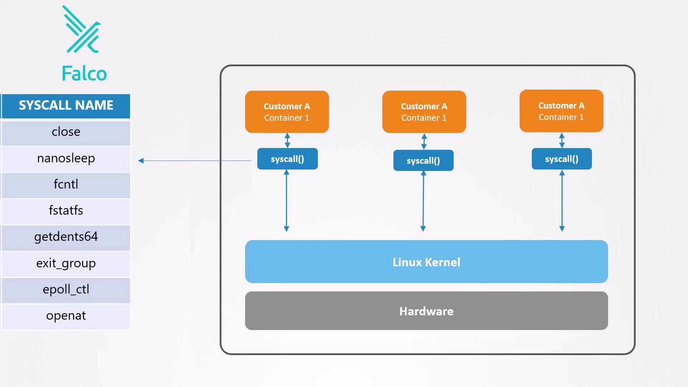

# Observability Overview

- Observability is a **core pillar of Kubernetes security**. It allows teams to **monitor, detect, and respond** to suspicious activity or system failures.
- Even with hardened control planes, workload isolation, sandboxing, mTLS, and strict network policies, attackers may eventually find a way in. 
- Observability lets us detect compromises early, reduce the blast radius, and recover swiftly.

## 🚨 Why Observability Matters
- Helps **detect misconfigurations, attacks**, and **performance bottlenecks**.
- Enables **auditability** and **compliance reporting**.
- Crucial for **incident response and forensics**.

## 📊 Key Components of Observability

| Component     | Description |
|---------------|-------------|
| **Logging**   | Collecting and storing logs from pods, nodes, control plane components. |
| **Monitoring**| Measuring system health via metrics (CPU, memory, latency, etc.). |
| **Tracing**   | Tracking request paths across distributed services. Useful for performance and debugging. |
| **Auditing**  | Recording all Kubernetes API interactions. Essential for detecting policy violations. |

## 🛠️ Tools Commonly Used

| Tool        | Purpose |
|-------------|---------|
| **Prometheus** | Monitoring & alerting |
| **Grafana**    | Visualization dashboard |
| **Fluentd / Logstash / Loki** | Log collection and aggregation |
| **Jaeger / OpenTelemetry** | Distributed tracing |
| **Kubernetes Audit Logs** | Built-in audit logging |
| **Falco** | Runtime security monitoring (e.g., suspicious syscalls) |

---

# Introducing Falco
- Falco is an open-source runtime security project by Sysdig. 
- It hooks into the Linux kernel to capture syscalls from containers and applies rules to detect:

    

    - **Unexpected shell access** inside a container
    - **Reading sensitive files** like `/etc/shadow`
    - **Deleting or truncating logs** to cover tracks

## Common Indicators of Compromise

| Suspicious Activity | Description | 
|---------------------|-------------|
| Unexpected shell in container | `kubectl exec -ti <pod> -- bash` opens an interactive shell |
| Accessing password hashes     | `cat /etc/shadow` |
| Deleting or truncating audit logs | `> /opt/logs/audit.log` |

### Example session that Falco would flag:
```bash
# Open a shell in the nginx-master pod
kubectl exec -ti nginx-master -- bash

# Attempt to view password hashes
cat /etc/shadow

# Erase audit logs
> /opt/logs/audit.log
```
- Even legitimate administrative tasks can generate alerts—allowing to confirm whether activity is expected or malicious.