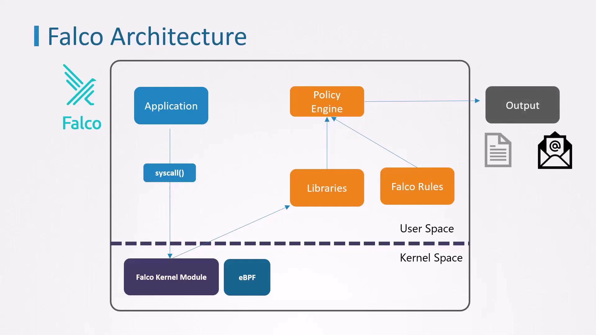

# Observability Falco Overview and Installation

## 🧐 What is Falco?
- Falco is a **CNCF project** designed for **runtime security** monitoring in containerized environments.  
- It detects **unexpected or suspicious behavior** in containers, Kubernetes nodes, and the host OS.

## 🚨 What Can Falco Detect?
Examples of Falco detection:
- A shell is run inside a container
- A container tries to read sensitive files (e.g., `/etc/shadow`)
- A container spawns a new process unexpectedly
- A file is created or modified in a restricted directory

## ⚙️ How Falco Works
1. **Kernel Module** or **eBPF Probe**: Captures system calls.
2. **Falco Rules Engine**: Matches syscalls with rule definitions.
3. **Alerts/Logs**: Generates alerts for security-relevant behaviors.

    

## Installation Methods
- There are two common ways to deploy Falco, depending on your access level and platform restrictions:

| Method                        | Use Case                                    | Advantages |
|-------------------------------|---------------------------------------------|-------------|
| Native Linux Installation     | Full root access to a Linux node            | Isolated from Kubernetes control plane |
| Kubernetes DaemonSet via Helm | Managed clusters or restricted environments | Easy upgrades and centralized management via Helm | 

### Installing Falco on a Linux Node
- Use this approach to install packages and kernel modules directly on host. 
- It ensures Falco remains operational even if your Kubernetes control plane is compromised.
    ```bash
    # Add the Falco GPG key and apt repo
    curl -s https://falco.org/repo/falcosecurity-3672BA8F.asc | apt-key add -
    echo "deb https://download.falco.org/packages/deb stable main" \
    | tee /etc/apt/sources.list.d/falcosecurity.list

    # Update and install
    apt-get update -y
    apt-get install -y linux-headers-$(uname -r) falco

    # Enable and start the Falco service
    systemctl enable --now falco
    ```

### Deploying Falco in Kubernetes via Helm
- If using a managed Kubernetes service or prefer Kubernetes-native deployment, use Helm to install Falco as a DaemonSet:
    ```bash
    # Add the Falco Helm repository
    helm repo add falcosecurity https://falcosecurity.github.io/charts
    helm repo update

    # Install Falco
    helm install falco falcosecurity/falco
    ```
- After installation, verify that Falco agents are running on each node:
    ```bash
    kubectl get pods -l app=falco
    # Example output:
    # NAME         READY   STATUS    RESTARTS   AGE
    # falco-7grdt  1/1     Running   0          2m21s
    # falco-tmq28  1/1     Running   0          2m21s
    ```

    