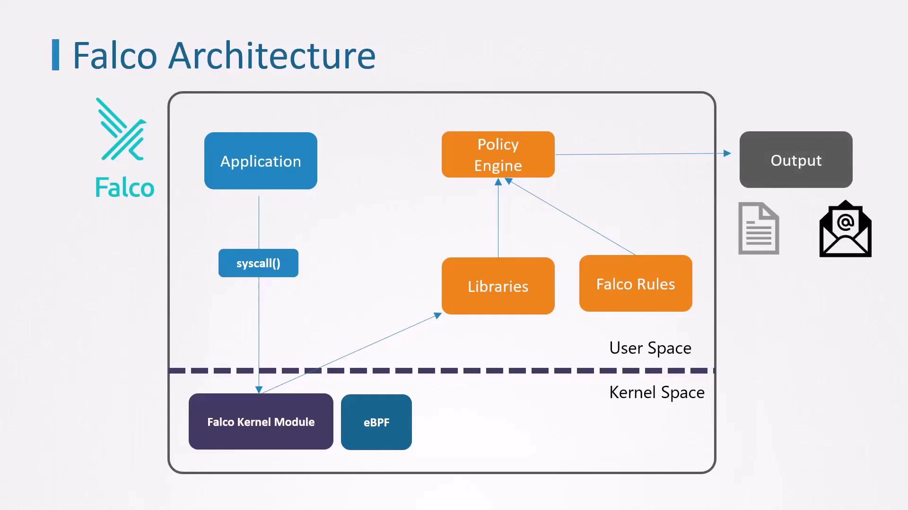

# Observability Using Falco to Detect Threats

- Now that Falco is installed on the cluster nodes, we can detect and alert on suspicious behavior. 

## 1. Verifying Falco Installation
- First, ensure Falco is active on each node.
- If installed Falco directly on the host:
    ```bash
    sudo systemctl status falco
    ```
- Should see output similar to:
    ```bash
    ● falco.service - Falco: Container Native Runtime Security
        Loaded: loaded (/usr/lib/systemd/system/falco.service; enabled; vendor preset: enabled)
        Active: active (running) since Tue 2021-04-13 20:42:45 UTC; 1min 2s ago
            Docs: https://falco.org/docs/
    Main PID: 17994 (falco)
        Tasks: 6 (limit: 4678)
    CGroup: /system.slice/falco.service
            └─17994 /usr/bin/falco --pidfile=/var/run/falco.pid -c /etc/falco/falco.yaml
    ```

> [!NOTE]
> If Falco is deployed as a DaemonSet, use `kubectl get pods -n falco-driver-loader` to verify all Falco pods are running.

## 2. Deploying and Testing with nginx
1. Deploy an nginx pod
    ```bash
    kubectl run nginx --image=nginx
    ```
2. Check pod status and its node
    ```bash
    kubectl get pods -o wide
    ```
3. Stream Falco logs
- In a separate terminal, SSH into the node running the nginx pod:
    ```bash
    ssh user@<node-ip>
    sudo journalctl -fu falco
    ```
4. Trigger an alert
- Back in the first terminal, open a shell inside the nginx container:
    ```bash
    kubectl exec -ti nginx -- bash
    ```
- Inside the container, read a sensitive file:
    ```bash
    cat /etc/shadow
    ```
- Falco will immediately log alerts for the shell spawn and file access events.

## 3. Falco Architecture



This diagram shows:
- Applications generate system calls
- Falco’s kernel module/eBPF captures events
- Libraries forward events to the policy engine
- Rules define alert conditions
- Outputs include stdout, alerts, notifications

## 4. Falco Rules Overview
Falco rules are defined in a YAML file. Each file can include:
- `rules`: Alert definitions
- `lists`: Named collections of values
- `macros`: Reusable filter expressions

### 4.1 Anatomy of a Rule
- Every rule requires these five keys:
    ```yml
    - rule:      # Unique rule name
      desc:      # Human-readable description
      condition: # Boolean expression against event fields
      output:    # Alert message template
      priority:  # Severity (e.g., DEBUG, INFO, WARNING, CRITICAL)
    ```
- Example: Built-in rule that detects a shell inside a container:
    ```yml
    - rule: OpenShellInContainer
      desc: Alert when a shell (e.g., bash) is spawned inside a container
      condition: container.id != host and proc.name = bash
      output: Shell opened in container (user=%user.name container=%container.id)
      priority: WARNING
    ```

## 5. Creating a Custom Rule
- Let’s write a simple rule to catch any shell launched in a container:
    ```yml
    - rule: DetectShellInsideContainer
      desc: Alert if a shell such as bash is opened inside any container
      condition: container.id != host and proc.name = bash
      output: Bash shell opened (user=%user.name container=%container.id)
      priority: WARNING
    ```

## 6. Sysdig Filters Reference

| Filter                     | Description |
|----------------------------|-------------|
| container.id               | Unique container identifier | 
| proc.name                  | Name of the process | 
| user.name                  | Username that initiated the event | 
| container.image.repository | Container image name | 
| fd.name                    | File descriptor path (e.g., /etc/shadow) | 
| evt.type                   | System call name (e.g., execve, open) | 

## 7. Extending Detection with Lists
- To monitor multiple shell types, define a list:
    ```yml
    - list: linux_shells
      items: [bash, zsh, ksh, sh, csh]
    ```
- Update the rule to reference the list:
    ```yml
    - rule: DetectShellInsideContainer
      desc: Alert if any common shell is opened inside a container
      condition: container.id != host and proc.name in (linux_shells)
      output: Shell opened (user=%user.name container=%container.id proc=%proc.name)
      priority: WARNING

    - list: linux_shells
      items: [bash, zsh, ksh, sh, csh]
    ```

## 8. Simplifying with Macros
- Falco’s built-in macro `container` is shorthand for `container.id != host`. Use it to make rules more concise:
    ```yml
    - rule: DetectShellInsideContainer
      desc: Alert if any common shell is opened inside a container
      condition: container and proc.name in (linux_shells)
      output: Shell opened (user=%user.name container=%container.id proc=%proc.name)
      priority: WARNING

    - list: linux_shells
      items: [bash, zsh, ksh, sh, csh]
    ```
