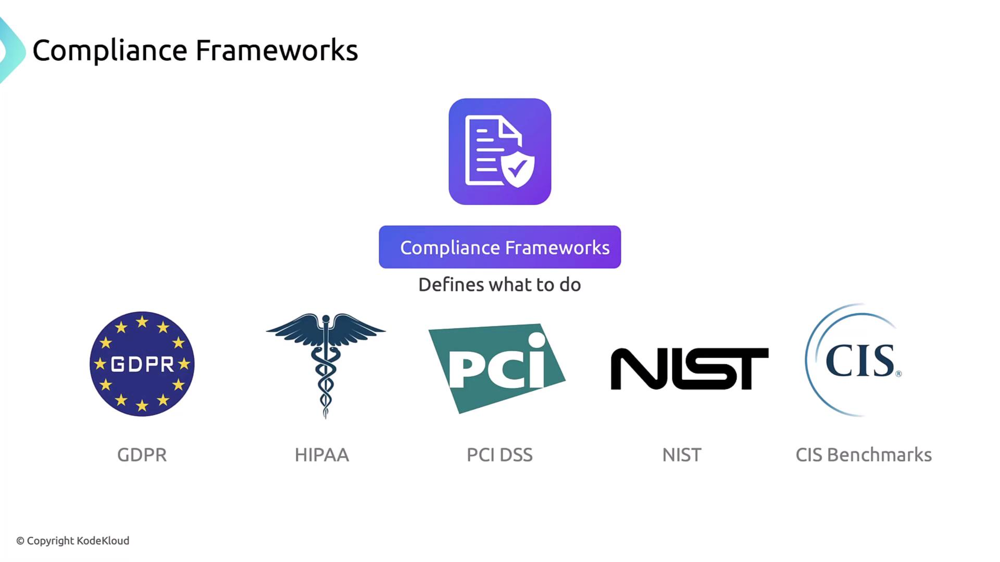

# Threat Modeling Frameworks

## Compliance Frameworks vs Threat Modeling Frameworks
- Compliance frameworks - such as GDPR, HIPPA, PCI DSS, and CIS Benchmarks define **what** security controls and processes are required for regulatory or industry compliance.

- Threat modeling frameworks fill this gap by offering structured methods - like attack trees or matrices - to discover potential attacks and recommend specific countermeasures. 
- Two widely adopted models are:
    - [STRIDE](https://docs.microsoft.com/security/compass/stride) (Microsoft)
    - [MITRE ATT&CK](https://attack.mitre.org/) (Global knowledge base)

### STRIDE: Six Threat Categories
- STRIDE breaks down threats into six distinct types, helping teams audit applications or infrastructure end to end:

| Threat Type | Definition | Common Mitigation | 
|-------------|------------|-------------------|
| Spoofing | Impersonation of a legitimate user or system | Multi-factor authentication, certificate-based auth |
| Tampering | Unauthorized modification of data in transit or at rest | Encryption, digital signatures |
| Repudiation | Denial of actions performed (e.g., transactions) | Comprehensive logging, non-repudiation techniques |
| Information Disclosure | Exposure of sensitive data | TLS for transit, disk encryption |
| Denial of Service | Resource exhaustion or service disruption | Rate limiting, resource quotas, autoscaling policies |
| Elevation of Privilege | Unauthorized gain of higher-level permissions | Role-Based Access Control (RBAC), least privilege | 

### MITRE ATT&CK: Real-World Tactics & Techniques
- The MITRE ATT&CK framework catalogs adversary tactics (goals) and techniques (methods) observed in the wild. 
- For Kubernetes environments, these techniques map to cluster-specific scenarios:
    - **Initial Access**: Exploit weak authentication, compromise cloud credentials
    - **Execution**: Deploy malicious containers or init-hooks
    - **Persistence**: Create backdoor user accounts, install rogue controllers
    - P**rivilege Escalation**: Abuse misconfigured RBAC or admission controllers
    - **Defense Evasion**: Disable logging, tamper with audit trails

## 📌 Summary
By combining compliance frameworks (GDPR, HIPAA, NIST) with threat modeling (STRIDE, MITRE ATT&CK), security teams can:
    - Understand **what** requirements apply to your environment.
    - Determine **how** to implement controls that mitigate real-world threats.
    - Continuously refine defenses through structured threat analysis.
