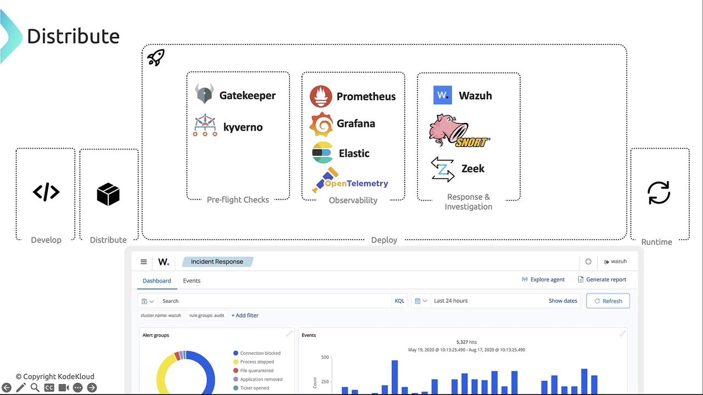

# Automation and Tooling

## Cloud Native Security Wallpaper
- The Cloud Native Security Wallpaper provides foundational guidance authored by industry experts.
- To interactively explore security tools mapped to each phase of the application lifecycle, visit the Cloud Native Security Map.
- Cloud Native Security Map includes **Develop, Distribute, Deploy, and Runtime** phases.

## Development Phase
- The **Develop** phase emphasizes "shift-left" testing by integrating security early in code, Dockerfile, and infrastructure-as-code creation. 
- Commit artifacts to repositories (GitHub, GitLab, etc.) with automated checks to:
    - Block high-severity vulnerabilities when fixes exist
    - Enforce non-root container execution
    - Restrict allowed base images

## Distribution Phase
- In the Distribute phase, CI/CD pipelines build, test, and push container images to registries. 
- Common tools include:

| CI/CD Pipeline Tool | Use Case |
|---------------------|----------|
| Tekton | Kubernetes-native pipelines | 
| Jenkins | Extensible automation server | 
| Travis CI | Cloud-hosted continuous testing |
| CircleCI | Container-based CI |
| Flux CD | GitOps continuous delivery |
| Argo CD | Declarative GitOps controller |

- Before building images, enforce policy compliance on manifests:
    - **KubeSec** scans Kubernetes YAML for misconfigurations.
    - **TeraScan** validates IaC (Terraform, Dockerfile, Helm, CloudFormation) against CIS, NIST, GDPR, HIPAA.
- After validation, build and scan images:

| Scanner | Scope | Example Command |
| Trivy | Container images, filesystems, Git repos | `trivy image myapp:latest` |
| Clair | Static image analysis via API | API integration |
| Grype | Images & filesystem scanning | `grype myimage:tag` |
| Nuclei | Custom checks via YAML templates | `nuclei -t templates/` |

- To secure the software supply chain, use signing frameworks:
    - **in-toto** – End-to-end supply chain security
    - **Notary**, **TUF**, **Sigstore**

## Deployment Phase
The **Deploy** phase covers pre-flight checks, observability, and incident response:
- Pre-flight Checks
    - **OPA Gatekeeper** – Policies in Rego
    - **Kyverno** – YAML-based policy management
- Observability
    - **Prometheus** + **Grafana**
    - **Elasticsearch** + **Kibana**
    - **OpenTelemetry**
- Response & Investigation
    - **Wazuh**
    - **Snort**
    - **Zeek**

## Runtime Phase
Once applications are live, enforce continuous security and reliability:
- CIS Benchmarking
    - **kube-bench** – CIS checks for Kubernetes clusters:
- Runtime Security
    - **Falco** – System call monitoring
    - **Trivy** – Continuous workload scanning
    - **SPIFFE** – Workload identity via certificates
- Service Mesh
    - **Istio, Linkerd**
- Storage Orchestration
    - **Rook, Ceph, Gluster**
- Access Management
    - **Keycloak, Teleport, HashiCorp Vault**

---

## 📌 Summary
- **Develop**: Shift-left scanners & IDE plugins
- **Distribute**: CI/CD pipelines, manifest & image scanners, signing frameworks
- **Deploy**: Policy enforcement, observability, incident response
- **Runtime**: Continuous monitoring, service mesh, access & storage management
